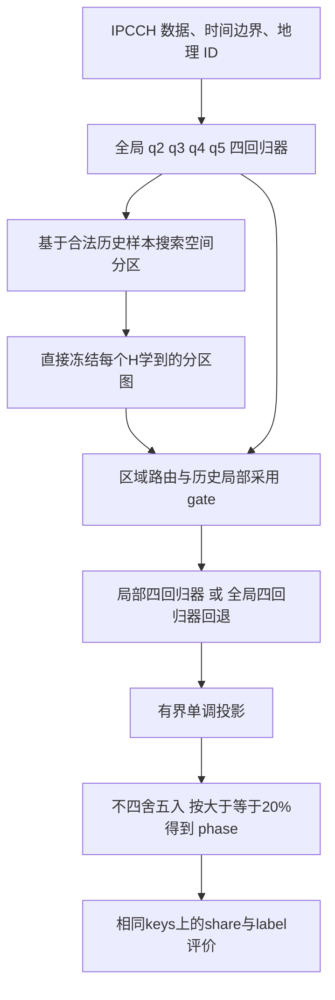

# GeoXGB over IPCCH cumulative-share regression — specification v1.0

**科学设计及独立包边界已采用；R51授权基建→冻结→Claude执行，Codex监督。** 用户确认的需求见prd.md；科学/执行基线见implement.md及三个JSON身份清单；P0基建须先经核验冻结，尚未训练或验证收益。历史条款中的未授权说明由最新R51的顺序授权覆盖，不改变科学约束。
用户已根据 `research/stage2-necessity.md` 的调查采用首版无共识Stage2：每个H直接学习并冻结一张地图。此前logit共识权重提案未获采用，不进入首版设计。

## 1. 三套基座的职责

| 本地来源 | 可复用职责 | 不能直接继承 |
|---|---|---|
| `FEWSNETGeoXGBExperiment/` | global/local booster生命周期、空间候选搜索骨架、历史局部采用gate、模型与拟合key保存 | four-class softprob/int labels/argmax、分类专属q统计、FEWS特征与日期、interruption实验设计；首版不采用共识阶段 |
| `IPCCHGeoRFExperiment/` | IPCCH原始key/QC、日历对齐、地理ID/邻接、数据与报告证据结构 | 二分类`q3 > .20`、RF模型、旧特征/窗口/预测期的自动选择；本次明确不继承最近邻donor分区补全 |
| sibling `IPCCH/src/ipcch/` | 四个累计人口占比回归与 20% 解码流程 | 旧 rounding/删行、任一特定实验的 oracle-weather、calibration、生产推理 scope |

补充参考 `IPCCHPopulationHistoryExperiment/` 的 q3 回归与历史特征：它不是 GeoRF 连续回归包；用户已明确采用其rich561特征配方，边界见第10节。
目前找到的 IPCCH GeoRF 完成包实际上是 share-derived binary classification；尚未确认另有连续 share GeoRF 包。

## 2. 回归与决策单元

对行政区 i、目标月 T、预测期 H∈{1,3,6,12}个月，定义 origin O=T−H。合法特征为 X(i,O)，目标为 T 的累计人口份额：

```
q2 = p2 + p3 + p4 + p5
q3 =      p3 + p4 + p5
q4 =           p4 + p5
q5 =                p5
```

四个独立回归器分别拟合 q2/q3/q4/q5。这里的 ensemble 是四输出共同决定标签；不是四种子平均。
share 的预测均值不是“该地区发生危机的概率”，不得直接作为该事件的校准概率。

用户已确认常数目标仍走统一XGB平方损失拟合。对每个合法、非空拟合池，分别记录q2..q5是否恒定及常数值；恒定本身不构成该目标或整个组合的拒绝理由。global照常拟合该目标booster，local保留对应global prefix并追加局部树，不用硬编码常数覆盖其预测，也不沿用旧人口历史包直接返回constant_target/model=None的捷径。
各模型仍须满足已确认的样本支持、投影/解码及组合采用gate；有限轮局部增量不保证恒定训练目标的预测精确等于该常数。常数目标不等于空拟合池或非有限数值；第4节已明确必需global空池停止，数值异常按本节已确认的技术错误契约处理。

已确认的预测决策：`phase_hat = max({1} union {k: q_star[k] >= 0.20, k=2..5})`，q_star 为下述有界单调投影结果。
用户已确认固定门槛包含等号：`>=0.20`，恰好 20% 算达到该 phase，门槛前不四舍五入。
用户已确认真实 phase 由真实人口占比构造：使用真实 q2..q5 经同一门槛/最高阶段规则得到 phase_truth。
真实值和预测值统一使用 `>=0.20`；已确认的占比分母、标准化及缺失规则见第9节。旧 GeoRF 的严格 `>0.20` 标签与本契约不同，必须由真实人口数据重新构造，不能直接复制其二分类标签。
单独保存原始浮点预测、投影后预测与显示值；显示精度不参与解码。
用户已确认保留 q2..q5 四回归器与五级原始 phase 解码。四分类评价将 phase4/5 合并为一类，形成 1、2、3、4/5；二分类由解码后的 phase 得到：phase1–2 为非危机，phase3–5 为危机正类。真实值、预测值和 persistence 使用相同映射。评价合并不删除 q5 回归器，也不将后端改成四分类 softprob。

四个独立回归输出可能违反 `q2>=q3>=q4>=q5`，平方损失也可能产生 [0,1] 外预测。
旧 operational `cummax` 只修复阈值后的二值列，不能声称修复了连续 share。
用户已确认：每行对原始四预测作等权、带边界的最小二乘单调投影，
`q_star = argmin_z sum(k=2..5) (z_k - q_raw_k)^2`，约束为 `1>=z2>=z3>=z4>=z5>=0`。
该操作仅使用当前行预测，不拟合真实标签或跨样本校准曲线；所有 root/local/验证/最终预测使用同一规则。
使用 q_star 在不四舍五入的情况下按固定门槛解码，同时保留 q_raw 和修正量。
所有参与搜索、选择、gate 与最终报告的标签预测均经过同一投影/解码流程；不能仅在最终报告修正。
投影后 `phase_hat>=3` 等价于 `q_star3>=.20`；该等价关系不保证对 q_raw 成立。
投影可能同时上调/下调不同目标，也可能改变 phase；它不是保证 F1 提升的方法。
投影不用于修补真实人口目标；非有限预测也不能伪装成合法share。真值QC见第9节；原始四预测在投影/解码前须显式检查有限值、shape与key对齐，投影结果也须满足有限值及既定约束。
用户已确认技术错误契约：Stage1搜索/配置评价及Stage3历史/当前拟合中，任一已尝试的global/local四模型拟合或预测抛错、任一原始q预测NaN/Inf、输出shape/key错位、投影失败、global prefix保留约束被破坏或必需模型/schema/地图产物损坏或身份冲突时，记录stage/H/origin/候选/区域/目标及受影响keys或其引用和错误原因，停止受影响运行并标记未完成。已完成证据仅保留为partial，不能宣称完整结果。局部技术错误也不能伪装成正常global回退；不得逐目标混搭、删掉失败记录/日期/候选继续评分、用常数填补输出或更换种子/容量/窗口试到成功。正常支持/gain不足及预期未分配地区仍按既定parent/global回退，合法特征NaN与undefined指标NA保持各自政策，有限越界或不单调预测仍按已定投影处理。恢复/重试不授权改变冻结科学配方；源码依据和完整边界见 `research/error-policy.md`，实现按R51及implement.md执行。
用户已确认q3 R²以投影后q_star3为主表、投影前q_raw3为补充诊断，二者在同一cohort使用相同真实q3及相同keys。投影不保证单独改善q3 R²，不得根据评价结果交换主次。

## 3. 已确认的外层空间结构：各H直接学习地图，无共识Stage2



用户已确认 q2–q5 使用共享分区图、每区域完整四回归器、四目标共同路由。这样空间区域对应一个完整决策单元。
每个目标 k 各有自己的 global booster；区域模型保留该目标的 global prefix，追加少量局部树。
不共享不同目标之间的 booster，也不把四个回归器称作多分类模型的四个类树。
采用已确认的 shared-root 结构：每个区域从对应 global 开始，不在深层累计所有祖先 local 树。
当前 parent route 仍是 split 比较及回退对象；生成新 child 的 prefix 与比较对象要分别记录。
用户已确认四模型作为完整组合共同采用或回退；最终局部改善不足时使用全局四模型组合，
不逐目标混搭 local/global。split与部署采用门槛、局部结构/类别支持、全局支持及回退见第4节；已确认容量表如下。
用户已确认配置共享范围：每个H仅选择一套global配方G_H和一套local增量配方L_H；同H的q2..q5全局模型共用G_H，各目标/各学习区域的局部增量共用L_H，Stage1和Stage3历史/当前拟合沿用冻结配方，不按目标、地区或日期重新调参。不同H可以选不同G/L组合，选择只用开发期危机F1。这里共享的是超参数，四目标的booster、各区域增量及各fold拟合仍独立；已确认的各目标对应global prefix保持不变，不共享跨目标树、叶权重或训练目标。旧IPCCH实际对q3单独设参，本次已明确选择首版统一配方。证据及候选容量参考见 `research/model-capacity.md`；数值容量与固定拟合参数已确认，配置评分见第4节R44，递归预算见R45，候选规模细则见R46，拟合复用与总计算量见R48，软件环境见environment-lock.json。

用户已确认数值容量表：global采用深度{3,4}×轮数{200,400}的4个候选，local采用(深度1,追加20轮)或(深度2,追加40轮)，每H共8个G/L配方对，四H共32个配方对；这是候选配方数量，不是拟合次数或共识地图池。共同eta=.05、seed42、固定轮数且不早停；global的min_child_weight/lambda/alpha=10/10/0、行列采样=.8/.8，local为20/20/1和1/1。global显式base_score=.5，local保留对应global的base score和已有树，不累计祖先增量。固定复现设置采用CPU hist、gbtree、num_parallel_tree=1、nthread4、gamma0、max_delta_step0、max_bin256、depthwise；四目标后端为reg:squarederror，不继承分类专用参数。完整表、源码边界及欠拟合取舍见 `research/model-capacity.md`。配置评分日历/平局规则见第4节R44；递归预算见R45，候选规模细则见R46，拟合复用与总计算量见R48，软件环境见environment-lock.json；训练按R51及implement.md的阶段顺序执行。
用户已确认H=1、3、6、12分别独立学习一张空间分区图；同一H内q2–q5共图。地图仅用截止2022-12的合法开发信息确定，在主评价及2026补充评价期间冻结，滚动拟合不改图。
用户已确认首版省去共识Stage2：各H直接学习并冻结自己的地图，不混合其他H的地图，也不为共识构建月度/年度多图池。空间学习仍可递归提出并评价child分裂；这些是形成单图的内部候选，不是供第二阶段聚合的地图集合。
首版不执行多图加权相似度、k40稀疏化、eigengap或谱聚类共识，也不设置logit共识权重。用户已确认未学习/未可靠分配地区直接global回退，不做最近邻分区补全，见第14节；邻接平滑、无硬连通约束及完成包底图复用见第15节，并保留上游匹配来源限制。开发切分已确认为第13节的区内时间各半F/S；数值容量与固定拟合参数已确认，配置评分见第4节R44，递归预算见R45，候选规模细则见R46，拟合复用与总计算量见R48，软件环境见environment-lock.json。四张图可以相同或无有效分裂，无有效分区时回到同源global四模型。
本文保留来源编号Stage1（分区学习）与Stage3（滚动预测/局部采用）以便追溯；编号不表示存在待执行的Stage2。
从头训练区域四模型或各目标单独分区不进入已选架构；实现按R51及implement.md执行。

## 4. 自适应统计分区的接口

| 层 | 必须确定的量 | 已确认方向与待定细节 |
|---|---|---|
| F fitting | 连续目标、损失、训练权重 | 四路squared error、每个原始训练key权重1；容量采用第3节已确认G1–G4/L1–L2固定配方 |
| S search | 行/区域误差统计及 q-scan | 已确认以parent四预测投影/解码后的危机TP/FP/FN构造单列F1误差扫描；不直接输入四维share或以连续残差替代 |
| S split acceptance | parent 与 child 完整路由比较 | 第13节S验证集上相对当前parent的危机F1增益严格>0，并满足下述结构/类别支持 |
| 开发诊断/配置选择 | 配置候选与选择规则 | 同一开发F/S和R45递归预算，完整S上最终路由的绝对危机F1排名；精确同分依下述固定顺序选择，候选规模/排序同分细则已由R46确认 |
| Stage2 consensus | 不适用 | 用户已确认首版省去；无共识候选池、权重或谱聚类地图 |
| Stage3 local gate | 局部与同源全局的历史增益 | 已确认统一最近最多6个观测月份回放、区域合并混淆计数F1相对fold-global严格>0.01及下述结构/类别支持 |

用户已确认配置选择（R44）：每H八个G/L配方使用同一2014–2022原始key F/S及同一候选搜索预算；各自完成Stage1后，在完整共同S上按最终已接受路由预测、统一投影/解码，合并TP/FP/FN计算危机F1，选绝对F1最高的配方，不按相对各自global的增益排名。精确同分依次选终端学习分区更少、G+L名义轮数更少、global深度更浅、local深度更浅、固定G/L编号更小者。按混淆计数分数精确比较，不按显示小数；无分裂root计一个终端区域，图外global回退不额外算学习区域。无分裂候选以global分数正常参选，NA不填0、全NA则记录selection_unavailable且不冻结赢家；技术失败不能跳过该候选继续宣布选择完成。直接冻结获胜地图及配方，不合并地图或以F+S重学另一张图；Stage3继续按既定滚动窗口重拟合，matched pooled对照使用该fold同一获选G_H的global四模型以保持无分区等价。保存八个候选的成员keys、原始/投影预测、标签、混淆计数、地图/路由及完整排名和平局理由，支持不重训重算选择。此方案复用S作分区搜索与配置排名，分数仅为偏乐观的内部开发成绩，不是独立前推验证，也不直接优化整个Stage3历史采用策略。首版不额外增加滚动开发筛选层；完整边界及取舍见 `research/configuration-selection.md`，递归预算见R45，候选规模细则见R46，拟合复用与总计算量见R48，软件环境见environment-lock.json。

最新 GeoXGB 的严格 F1 gain gate 是经验接受规则，并不是显著性检验；eigengap 也不是统计功效证明。
用户选择沿用经验增益门槛，本轮不新增逐分裂显著性检验；最终比较的不确定性报告已由第5节R49确认。
不能直接对相邻区域、重复报告月份或多个 horizon 视图执行 IID t 检验。
原始 outcome/report keys 是支持计数依据；四目标、四 horizon 或 augmentation 不能创造独立观察。
无改善、无有效分区、无支持、无可靠映射是允许的回退结果；不能为了产生分区放松门槛。

用户已确认沿用最新 GeoXGB 的两级经验增益 gate。
Stage1 候选完整路由在同一验证 keys 上，危机 F1 相对当前 parent 严格增加 `>0` 才接受；平局保留 parent。
Stage3 区域四模型组合在相同合法历史 gate keys 上，危机 F1 相对该 fold 的 global 组合严格增加 `>0.01` 才采用；
否则回退 global。这里的0.01是 F1 绝对增量（1个百分点），不是相对提升1%。两层均须另行满足支持规则。
平局不分裂，增益恰好0.01不启用局部组合。gate 使用统一投影/解码后的危机标签。
这些是预测表现接受门槛，不构成统计显著性声明；结构与危机类别支持已确认如下，Stage1 F/S切分见第13节，Stage3历史验证日历见本节后文。用户已确认gate任一所需F1为NA时不接受候选：Stage1保留parent，Stage3回退global；不把NA填0后计算增益。

用户已确认采用最新GeoXGB的局部结构支持下限（当前源码证据见 `research/support-gates.md`）：

| 环节 | 有效原始keys | 不同行政区 | 不同目标月份 | 额外要求 |
|---|---|---|---|---|
| Stage1每个候选区域拟合 | >=500 | >=50 | >=6 | 四目标共用该拟合池 |
| Stage1每个候选区域验证 | >=100 | >=20 | >=3 | 真实危机/非危机各>=20个keys |
| Stage3每次历史/当前区域拟合 | >=500 | >=50 | >=6 | 满足36个月窗口及当次信息截止 |
| Stage3区域历史验证合计 | >=100 | >=20 | >=3 | 真实危机/非危机各>=20个keys；至少3个历史验证日期有成功且支持合格的局部组合拟合 |

每个H分别按有效原始行政区×目标月key去重计数，四个q目标或重复视图不增加支持。月份数是区域池中不同目标月份的数量，不要求连续或每个行政区都达到该月份数；Stage3验证100/20/3是跨历史日期合计，不是逐日下限。
Stage1某候选区域不满足结构支持时该区域保留parent四模型，不能用不合格child贡献候选改进。Stage3历史或当前区域拟合支持不足时使用对应fold-global；历史回退日期不算成功局部拟合日期，也不能删除该日期验证keys来抬高增益。历史gate支持不够时不启用局部组合。
用户已确认新增危机类别支持：Stage1对每个拟采用的候选区域验证集、Stage3对每个区域跨历史验证日期的合计验证集，要求真实危机与非危机各>=20个原始keys，且仍须同时满足上述总量下限。类别依据本次真实人口share推导的phase>=3，不依据预测标签；各H独立去重计数，不要求每个历史验证月分别达到20/20。保存正负例计数及不足原因，失败时该区域保留parent或回退global，不删除验证/最终评价记录。
这些是工程筛选下限，不构成统计功效证明。20/20是本轮新增并经用户采用的规则，不能归因于旧包。原包的classes>=2属于分类后端条件，不直接作为四个连续目标的支持定义；验证20/20也不自动变成拟合池类别限制。常数目标已确认按第2节统一拟合，global/root支持已确认如下。

用户已确认global/root支持：Stage1根组合及Stage3每个必需的历史/当前global组合，只要合法QC后原始key拟合池非空，就按既定四回归器拟合，不套用local的500/50/6或危机正负类别下限；记录全部拟合keys、地区数、不同目标月份数、危机类别组成及每目标常数标记。非空仅表示操作资格，不等于统计充分或模型精度保证。必需的global拟合池为空时，记录stage/H/origin/窗口/原因并停止该运行、标记未完成；不能扩窗、删除历史gate日期/评价fold、调用未来模型或把persistence冒充模型预测。local及验证门槛保持不变；数值异常遵守第2节，最终预测折次与覆盖见R47。当前源码依据和取舍见 `research/support-gates.md`；训练按R51及implement.md的阶段顺序执行。

用户已确认沿用最新GeoXGB的单列crisis-F1误差扫描：将parent四回归输出先投影/解码，再按空间group汇总真实/预测危机的TP、FP、FN。令D_g=2TP_g+FP_g+FN_g、D=sum_g D_g，输入列为Y_g=D_g/D和A_g=2TP_g/D；误差质量c_g=Y_g−A_g，基准期望b_g=sum(c)*Y_g/sum(Y)。扫描对比空间误差与该基准期望，具体源码及公式见 `research/scan-statistic.md`。扫描中的倍率rho（原代码名q）与累计share q2..q5无关。
父区域D=0或sum(FP+FN)=0时不产生扫描候选并保留parent；单个group的D_g=0时贡献零扫描质量，不虚构正例支持。TN不贡献该F1扫描质量，但仍保留在支持计数、候选完整路由比较及最终评价中。候选仍须通过已确认的支持与真实危机F1严格增益gate；扫描分数不当作p值，也不以share残差或分类概率代替。Stage1搜索使用第13节的S；已确认先作第15节的3轮邻接平滑，再检查支持/增益。扫描迭代及递归预算已由R45确认；候选规模/排序同分细则已由R46确认。源码证据见 `research/geometry-connectivity.md`：现有polygon路径仅作邻居投票，不保证严格连通；已采用的几何版本及其上游行政身份provenance限制见第15节。

用户已采用调查建议，首版无共识层。旧IPCCH的稀疏支持证据及FEWS单图仍执行谱聚类的代码边界见 `research/stage2-necessity.md`；这些解释为何不自动移植共识，不构成新XGB必然无分裂的结论。今后若重启共识须另行提出候选池与比较契约，当前没有预留必做共识实验。

用户已确认递归搜索预算（R45）：root深度0，最高成员分区深度4，仅搜索parent深度0–3，最多16个终端成员分区；各H/G/L使用同一上限，不再叠加源码的80累计选择轮数cap。每个合格parent最多一次确定性单列scan初始化及固定1000轮迭代，采用最后候选，无种子重启或拒绝后重试；随后执行已定3轮平滑、支持检查、每个合格child最多一次四模型拟合及完整路由严格F1增益gate，仅接受的分裂继续递归。继承parent预测的child同样占一个成员深度，不强制分裂。该上限与XGB树深度及20/40实际追加轮数分别计数；每配方最多15次scan、30组local四模型（120次单目标local拟合），global及Stage3另计。32个配方最多480次scan、3840次local单目标拟合；若每配方分别拟合4个global，Stage1保守上界为3968次单目标拟合。该数学计数不含排序/平滑/预测成本，不是运行时估计或Stage3预算，也不授权训练。候选规模/排序同分细则已由R46确认，不默默继承旧flex的索引边界；源码证据及代价见 `research/recursive-search-budget.md`。

用户已确认候选规模规则（R46）：在每个parent中按不同学习行政区group计N，含零scan mass的S成员；扫描候选在平滑前每侧占45%–55%，即排序前缀长度m取闭区间[max(1,ceil(9N/20)),min(N−1,floor(11N/20))]的全部整数，边界用整数运算计算；无可行整数则保留parent、不扩范围。按扫描分数降序、精确同分按冻结area-ID顺序，选择允许范围内分数和最大的前缀；前缀和精确同分优先更接近一半，再选较小m。单列c/b初始化也使用相同分组函数（b=0处初始rank为0），初始化前缀和只是确定种子的规则，不称似然统计；随后仍为1000轮且取最后候选。枚举前缀规模不增加child拟合。3轮平滑后不强行恢复45%–55%，保留平滑前后规模并检查既定支持/F1，空侧不构成分裂；非空但支持不足的child继续按已定parent回退。此为明确整数边界的新契约，不是原flex代码的逐字移植，也不按人口、记录条数或国家平衡。代价是可能错过很小的高误差片区；细则及源码依据见 `research/scan-candidate-size.md`；执行遵守R51及implement.md。

用户已确认Stage3历史gate日历：在当前(H,O)，从全体有效人口目标台账取U<O的最近最多6个不同观测目标月份，统一作为各区域的历史日期；这些月份不要求连续，不按区域成绩选日期，不为凑支持向前追加更早月份，也不额外要求U落入当前O的36月拟合窗口。对每个U以V=U−H构造历史回归拟合，目标窗口[V−35,V]、训练特征按各行自身origin；预测U使用截至V的特征，不能用当前O的后续信息重建历史预测行。
各区域保留所有匹配验证keys，包括局部拟合支持不足而使用该fold-global的日期；跨日期合并TP/FP/FN后计算危机F1及增益，不平均月度F1。应用已确认的100/20/3、正负各20、成功且支持合格的局部拟合日期>=3、NA和严格>.01要求。支持不足日期不计入成功局部拟合日期；历史gate不足则当前组合回退global，不通过删日期/记录提高分数。必需global空池按本节已确认政策停止运行，不能删去该日期继续算gate；数值失败按第2节停止受影响运行，不能当作支持不足回退。
地图和配置固定为当前可用的开发冻结版本，可能使用了晚于历史V/U的开发信息；因此这是给定地图/配置的历史回放采用gate，不能称整个空间流程在V时已可实施的独立历史检验。当前O只使用其之前已观测的目标，最终预测T的真值不参与。依据及完整边界见 `research/historical-gate-calendar.md`；该日历和汇总规则已由用户采用；训练按R51执行，不授权主评价期调参。

## 5. 已确认的评价目标与内外层损失分工

用户在首轮 grill 确认以最终标签表现为主，并指定完整面板：

| 输出 | 必须报告 |
|---|---|
| 四分类标签 | accuracy、macro-F1 |
| 二分类标签 | accuracy、F1、precision、recall、F2 |
| 连续 q3 | 投影后q_star3的R²为主，原始q_raw3的R²补充 |
| 比较基线 | persistence，与模型在共同 eligible keys 上比较 |

用户已确认主表的汇总单位：每个H分别汇集主评价期全部有效行政区×目标月预测，每条记录等权；四/二分类指标从汇总后的混淆计数计算，q3 R²从该cohort整体的真实值与预测值计算。不得用逐月F1、macro-F1或R²的平均值替代，也不把不同H的同一目标重复视图混成一个主分数。
2026已有月份作为独立补充期使用相同汇总政策。model/persistence配对表在共同keys上计算，模型全样本结果另列，保留计数与覆盖率。逐月和逐国结果作为诊断，不改变主表逐记录等权的含义；观测较多的国家/月贡献更多，不作人口加权或国家/月度等权再平均。
此确认是最终报告的汇总规则；回归训练权重已由用户另行确认为下述逐记录等权。Stage3历史gate已确认为第4节的区域跨日期合并混淆计数；配置候选按第4节R44在完整共同S上合并计数、以绝对危机F1选择，首版无Stage2共识。

用户已确认：内层四个 XGB 用 squared error 拟合连续累计 share；外层空间分区和模型配置
按验证集上的危机正类 F1 选择，解码门槛固定为 `>=0.20`。最终报告全部指定指标并与 persistence 比较。
用户已确认回归训练逐记录等权：每个有效原始行政区×目标月key的sample_weight=1，q2–q5以及global/local采用同一政策。局部模型从同源拟合池按区域取子集，保留对应全局模型并以等权平方损失追加局部树。
不额外按人口、国家、危机类别或观测远近加权，不引入时间衰减、类别过采样或欠采样；不因四个目标而复制训练记录。这使连续回归拟合当前有效样本分布下的累计share，稀有危机记录没有额外权重；外层选择仍使用已确认的危机F1。此样本权重政策不决定内部跨折选择方式。
不使用硬 F1 或 soft-F1 custom objective；split/local gate比较对象、增益阈值、结构/类别支持及Stage3历史验证日历见第4节，Stage1切分见第13节。
这一分工保留连续 share 预测含义；硬 F1 依赖整组混淆计数且在阈值处不连续，不能直接作为
普通 XGB regression 的逐样本光滑梯度/Hessian。任何未来改动需作为新的设计决策。

其余指标和 q3 R² 均报告；R49不新增硬性退化阈值、加权综合分数或必须获胜的交付门槛，技术完整性与科学收益分别判断。
用户已确认 truth 来源为真实人口占比推导的 phase；该口径同时用于 F1 调优和最终分类评价。
类别映射已确认，见第2节；二分类 F1、precision、recall、F2 均针对危机正类计算，二分类 accuracy 针对全部二分类样本。
用户已确认无法定义的指标统一记NA并记录原因；以下规则适用于所有主表、补充表及诊断，模型与persistence一致：

- accuracy为正确数/n，n=0时NA。precision=TP/(TP+FP)、recall=TP/(TP+FN)、F1=2TP/(2TP+FP+FN)、F2=5TP/(5TP+4FN+FP)分别按自身分母判断，分母为0才NA；合法计算出的0保留，不因precision或recall为NA而错误传播到仍可定义的F1/F2。
- 四分类类轴固定为1、2、3、4/5，各类按one-vs-rest混淆计数算F1，再对四类等权平均。某类在真值和预测均未出现时，该类F1及四类macro-F1为NA，禁止跳过该类取nanmean或临时缩短类轴；同时保存各类支持和混淆计数。
- q3 R²=1−SSE/SST，n<2或真实q3的SST=0时NA并分别记录原因；正常的负R²保留，不裁成0，也不使用库对常数真值自动替换为0/1的默认值。
- Stage1或Stage3增益比较任一所需危机F1为NA，则不通过gate，分别保留parent或回退global。支持门槛仍须另行满足，F1可计算并不等于支持充足。

label persistence 的标签来源随用户决定固定为历史人口占比推导的 phase，不能换成 reported phase。
用户已确认：每个行政区采用 origin 时合法可用的最近一期有效真实人口观测，
将该期人口推导的 phase 延续到目标月；q3 persistence 使用同一期真实 q3。记录 source date/age。
按真实月份/可用性查找，不以稀疏表的上一行冒充上个月，也不使用目标期真值本身。
不能从一个 phase 编造连续 share。没有合法历史人口观测时 persistence=NA；保留模型预测，
分别报告模型全样本表现和 model/persistence 共同 keys 的配对结果及覆盖率。
q3 R²同样区分模型全样本与persistence配对样本；每个cohort内均以相同keys计算原始/投影后的模型R²，配对表再与同一期历史真实q3的persistence比较。不得用不同样本的R²差值解释投影或模型相对persistence的改善。
这一最近可用选择与缺失政策已确认；用户已采用第11节的观测月末可用口径，不能把该约定当作已核验的真实发布日期。
“与 persistence 比较”尚不等于要求每月/每国都获胜、显著优于基线，或所有内部 gate 都以 persistence 为对手。
已确认空间增益与局部采用比较同源 parent/global，最终模型效果另与 persistence 比较。

用户已确认最终比较与不确定性报告（R49）：每H分别在E_all上比较GeoXGB与R44同源matched pooled、在E_persist共同keys上比较GeoXGB与persistence，保留全部指定指标、逐项差值及覆盖率。仅对主评价期的两项危机F1差值增加95%国家整簇bootstrap描述性区间：各H/cohort固定seed42、2000次有放回抽国家，每次整带该国全部地区/月记录，双方共用国家倍数，合并TP/FP/FN再算ΔF1，不平均月/国或跨H分数。使用2.5/97.5线性百分位；仅当至少2个国家、点差值可定义且2000次差值全部有限时给区间，否则保留NA原因及原始抽样，不补抽、不填0或删坏draw后取分位数。2026和国/月诊断先只报点估计/差值/覆盖，不额外做区间。保存逐行预测及抽样台账以免重训；区间条件于已保存预测，只描述国家构成变化，不包含地图/训练不确定性、跨国共同冲击或未来年度外推，也无多重比较校正。逐H如实报告正负收益；不要求所有H必须战胜persistence才能完成研究交付，技术完整性仍独立核验，缺必需证据或技术失败仍不能宣称完成。与两套旧包的差异、完整NA/样本规则及解释边界见 `research/comparison-uncertainty.md`；执行遵守R51及implement.md。

## 6. 数据、评价和可复现边界

- 标签表保留原始 phase population/share 与 reported phase；QC/标准化产物另存，不能覆盖原值。
- 先保留完整月度特征 scaffold，再筛选有目标的监督样本；稀疏报告的行偏移不是日历 lag。
- 分区、超参数、约束政策、local gate 只能使用合法训练/开发信息，最终评价冻结后不再选模型。
- target month、origin、原始报告身份与 availability 分开；用户已显式采用第11节的 observation-month 约定，未核验历史发布/修订时点。
- 主目标与完整指标面板见第5节；不从最终评价结果调 loss、20% 门槛或分区规则。
- 官方 reported phase 保留原始字段；评价 truth 已冻结为 share-derived phase。缺失人口目标不能用 reported phase 回填；已确认的人口目标QC/缺失政策见第9节。
- 所有模型比较使用相同 eligible keys、拟合池、特征与 origin；局部只因区域成员资格取子集。
- 无分区时，新路径必须等价于同源 pooled 四模型；避免旧 IPCCH 包因排除未映射国家产生“分区收益”。
- 保存每次 fit 的四模型、特征顺序、拟合 keys、global prefix 身份、路由、地图、连续输出和 decoder 配置。
- 空间规则已确认为3轮邻接平滑、不强制分区连通，孤立地区保留候选归属并报告连通诊断，见第15节。donor政策已确定为不补全，未学习/未可靠分配地区使用global；底图采用完成包已修复版本并保留上游匹配来源限制。
- 数据/软件版本先沿完成包定位，执行前再验证；本次仅做源码研究，没有重放所有产物哈希或实验结果。

## 7. 已确认的预测期与数据范围

本地 IPCCH GeoRF 完成包采用 H={1,3,6,12}（`IPCCHGeoRFExperiment/README.md:18-25`），
IPCCH 研究流程另有 H={0,3,6,12} 的 nowcast/forecast 轴；二者不能按 fs 索引直接互换。
用户已确认：首轮采用实际月数 H={1,3,6,12}，不纳入 H0 nowcast。各 horizon 单独报告全部指标及 persistence 对比。
选择 horizon 本身不批准复制旧时间切分、旧标签或既有分数；新标签与新模型均须在共同 keys 上重新评价。

用户已确认：沿用 IPCCH GeoRF 完成包所绑定的 `IPCCH_2026_completed.csv` 原始数据版本，
保留其覆盖的全部国家/行政区范围，不按模型成绩筛选地区。源版本身份见 `research/architecture-evidence.md:40-44`；
执行前仍须重新核验实际字节哈希。目标QC、真实 share/phase 构造和最终样本数按本次契约重算，
不直接照搬旧二分类标签或有效样本计数；无监督标签地区保留在地理/覆盖台账，按R47仅为具有有效真值的行政区×月份生成评价预测。
用户已确认复用第15节指定的旧完成包修复几何及邻接；本轮已确认的外部时间边界见第8节、特征配方见第10节、Stage1内部切分见第13节。

源文件：`C:\Users\swl00\IFPRI Dropbox\Weilun Shi\Google fund\Analysis\1.Source Data\assembled_IPCCH\raw\IPCCH_2026_completed.csv`。
冻结的原完成包源 SHA256：`ae696087c3bbb280537ae269a05924133acdb51060d31290523404fa8a717673`。
权威历史依据：`.trellis/tasks/archive/2026-09/09-19-ipcch-binary-georf-pipeline/prd.md:25-43`。
该历史文档声明6,227行政区/53国家；这是源覆盖参考，不是本次已经重新验证的有效训练/评价样本数。

## 8. 已确认的开发与评价时期

用户已确认：以2014–2022作为可用的历史开发范围，分区、超参数与选择规则的最终信息截止为2022-12；
2023–2025为冻结方案的主回顾性评价期，2026已有月份单独作补充，不与主表合并。
Stage1采用第13节的截至2022-12 pooled开发F/S，只保证区内时间顺序，其内部S不是早期origin的严格前推回测。模型配置按第4节R44复用共同S评分选择，不新增滚动开发筛选层；Stage3历史gate按第4节回放，其固定地图/配置的条件性须单独说明，历史booster拟合仍不能提前使用整个2014–2022开发池。
所有主评价origin须>=2023-01，因而沿用旧包可解释的目标月边界：

| H | 首个主评价目标月 | 最后主评价目标月 |
|---|---|---|
| 1 | 2023-02 | 2025-12 |
| 3 | 2023-04 | 2025-12 |
| 6 | 2023-07 | 2025-12 |
| 12 | 2024-01 | 2025-12 |

冻结地图/参数选择规则不等于停止后续参数拟合；按已确认的滚动预测方向，在每个origin用当时合法历史重拟合，
但不因2023年及以后评价分数重新选择地图、超参数、门槛或报告范围。滚动拟合窗口已确认为第12节的36个日历月，历史gate日历见第4节；最终预测折次与覆盖见R47。
历史IPCCH实验已使用这一时段，故应明确称回顾性评价，不声称从未查看过的前瞻性独立测试。
历史依据：旧任务 `prd.md:156-175,207-225`。用户另行确认每H直接地图、无Stage2和区内时间各半F/S；旧包跨H共图未继承，同一原始key的分组在各H一致，但模型和地图分别学习。

用户已确认滚动预测覆盖（R47）：主评价按上表列出全部122个H×目标月fold（35/33/30/24），各fold仅预测当月全部通过本次人口QC的原始行政区keys，不因缺历史、缺persistence或未分配地图删行。若当月无有效目标，保留no_valid_target、n=0、指标NA的日历条目，不请求该fold的当前或历史gate拟合；非空预测fold中必需global空池仍按R40停止。2026仅在冻结源内实际具有有效人口目标的月份执行四个H，单独报告，并用全年月份覆盖台账说明哪些月份无有效目标；不按当前日期猜测源文件截止或自动追加新版本。不为无真值行政区×月份额外生成预测，不补造truth，但保留完整QC/地理/scaffold覆盖台账；这是有观测真值样本的回顾性评价，不能声称全地区逐月预测覆盖。当前T的truth只定义评价cohort并用于最终评分，不能进入特征、训练、gate、路由或配置选择；详情及源码依据见 `research/prediction-schedule.md`；执行遵守R51及implement.md。

## 9. 已确认的真实人口占比 QC 与目标构造

用户已确认：复用旧 IPCCH GeoRF 包的目标QC/比例标准化政策，解码则使用本次已确认的累计四目标和 `>=0.20`。
依据为旧任务 `.trellis/tasks/archive/2026-09/09-19-ipcch-binary-georf-pipeline/prd.md:65-81`，按以下顺序：

1. P1–P4占比必须观测；仅缺失P5允许按0处理，并保留填补标记。其他phase缺失不填补。
2. 已观测占比必须有限且在[0,1]；estimated_population必须观测、有限且严格为正。
3. 五项之和 S 必须在[0.90,1.10]（含端点）；不裁剪或挽救范围外总和。
4. 通过后按 `p_k=P_k/S` 比例标准化，再构造q2..q5。人口为有效性检查字段，不额外把已是share的字段再除以人口。
5. 真实phase按最高满足累计占比>=0.20的阶段构造，未达到q2门槛则phase1；其四/二分类映射沿已确认规则。

真实标签的边界保持源十进制精度，可用 `5*sum(P_k..P5)>=S` 的等价比较，避免先舍入商再判断。
回归目标保存标准化后的连续q；原始字段、S、标准化值、P5-fill和无效原因另存，不覆盖原始文件。
无效目标不进入监督训练/评分；其月度行仍可为合法协变量与地理覆盖提供scaffold。
P5缺失视为0是用户已采用的建模约定，并非已证明该缺失在源数据上必然表示0。
该政策已在本次grill中确认；标签/历史/持久性基线必须统一使用新>=20%语义，旧>20%标签产物不能原样复用。

## 10. 已确认的 rich561 特征基座

已核对 `IPCCHPopulationHistoryExperiment/README.md`、原任务 `technical-contract.md` 及现有构造代码，证据见 `research/feature-reuse.md`。
用户已确认：采用已存在的rich561特征配方作为全局/局部四回归器的共同输入，
包含original93及468列累计share、分布形态、观测间隔、变化/趋势和历史窗口统计。
每个历史值均按该样本自己的O=T-H构造；历史不足保留NaN，由XGB原生处理。
同一特征矩阵服务q2..q5，拟合池不因缺少persistence或历史统计而缩小。

现有缓存含旧>20%危机定义，所有二分类历史/危机频率/事件与持续时间特征须按新>=20%标签重算。
沿用 `IPCCHPopulationHistoryExperiment/config/feature-schema.json` 的561列名和顺序，更新语义版本及值哈希；不能把旧561矩阵当成本次可直接使用的特征产物。
本次采用范围为特征配方，不引入旧包按persistence状态调阈值、correction模型、history-only拟合/评分限制或额外对照臂。
代价是比93列更高的维度与历史依赖，需要已限定的开发期选择和小模型容量控制，不能预先承诺泛化提升。
八个历史序列为q2/q3/q4/q5、severity_index、entropy、concentration、severe_fraction=q4/q3（q3=0时NaN）。沿用最近六次观测槽及m06/m12/m24/m36/all实际日历窗口；均值/极值至少1次、总体标准差至少2次、斜率至少3次观测，否则NaN。历史来自同一行政区在该行origin前允许使用的完整有效台账，不限于拟合窗口，也不跨区聚合结果。
准确公式以原任务 `.trellis/tasks/archive/2026-09/09-21-ipcch-population-history-xgb/technical-contract.md` 第1–2节为复用依据，并应用本次目标QC与>=20%语义。可用性时间规则已确认，见第11节；执行前须固定新schema语义版本。

## 11. 已确认的观测月末可用口径

用户确认沿用IPCCH完成包的回顾性观测月份约定。对目标T、预测期H，origin O=T−H为含当月月末的截止；协变量、人口历史与训练标签只能取观测月份<=O的信息。persistence从同一行政区该截止内的有效人口台账选最近观测。
每个训练样本以其自身目标月U和预测期H得到origin U−H，并据此构造特征，不能用当前较晚的拟合origin重建历史特征。训练目标U在本次拟合origin前可用，不代表U的标签可进入该样本自身U−H的特征。
例如预测2024-01、H=6，origin为2023-07，信息截止2023-07月末。目标月季节sin/cos等预先已知日历信息按已采用配方使用，不代表允许目标月实测协变量。
此口径仅是观测月份对齐：没有核验源字段的历史发布日期、发布滞后或修订版本，不据此声称当时实时可得或完成发布版本回测。保存availability_policy身份、source_month和origin；不得把推定月末冒充已验证release timestamp。
依据：`.trellis/tasks/archive/2026-09/09-19-ipcch-binary-georf-pipeline/prd.md:102-108,150-154`。可用性与拟合窗口是不同约束；用户已采用第12节的36月滚动窗口及第13节的Stage1 pooled F/S。Stage1的拟合目标按F和2022-12开发截止约束，不保证全部早于每条S的origin，因此S仅称内部开发验证；各行特征仍按自身origin限制。最终滚动评价的训练目标必须<=当次O，不受这一开发切分例外放宽。

## 12. 已确认的36个月滚动拟合窗口

用户确认：对每次滚动预测的origin O，训练目标月份U须位于闭区间[O−35,O]，共36个日历月。global使用其中通过本次目标QC的合法训练样本，local仅因区域成员资格取该池子集；所有模型保持相同特征及信息截止契约。
例如O=2023-07，训练目标范围为2020-08至2023-07。稀疏报告不能用最近36条有效观测代替36个日历月，也不因窗口内缺失标签而自动扩窗。局部结构支持不足回退global，见第4节；global按非空池拟合，必需global空池停止运行。数值异常按第2节已确认契约处理。
每个训练行(U,H)仍使用自身origin U−H的特征，不能用拟合origin O的信息补齐。rich561历史特征与persistence查询各自截止前的完整有效台账，允许早于拟合窗口；36月约束的是训练目标日期，不是历史特征可追溯长度。
依据：`.trellis/tasks/archive/2026-09/09-19-ipcch-binary-georf-pipeline/prd.md:110-112`；人口历史包 `technical-contract.md:109-114` 亦采用这一边界。该36月窗口适用于滚动预测拟合；Stage1使用下述2014–2022 pooled F/S，不截为某个36月窗口。历史local gate的回放日历、拟合截止与条件性见第4节。

## 13. 已确认的Stage1区内时间各半切分

用户确认沿用IPCCH完成包的原始outcome切分规则。先从本次QC台账取目标月2014-01至2022-12的有效原始行政区×目标月keys，再在每个行政区内按目标月排序，计有效观测数n：

- n>=2：最早floor(n/2)条进入F拟合，其余ceil(n/2)条进入S搜索/验证；奇数时额外一条归S。
- n=1：标记singleton，不参与Stage1拟合、q-scan/group统计或parent/child split gate。
- n=0：不参与Stage1监督学习。n=0/1地区均保留在地理/scaffold与后续预测覆盖台账，不删除其原始记录；后续直接global路由见第14节。

先按原始key分组，再分别构造H=1/3/6/12视图；四H共享F/S成员身份，但分别拟合四回归器及地图，不混合训练视图或扩增支持。各行的rich561仍按自身O=T−H从合法历史构造；特征缺失不改变F/S分组。任何QC或几何限制导致的资格变化须单独记录，不能静默随机重分。
Stage1 global及候选local只以F目标拟合，S用于已确认的危机误差扫描和完整路由F1 gate。S目标不进入这些booster的拟合目标；历史特征仍遵守完整台账/自身origin契约。Stage1 singleton身份不禁止其合法人口观测成为以后origin的历史特征，也不限制其在Stage3满足当次36月窗口时进入全局训练池。
该切分只保证同一行政区的F早于S，不保证所有行政区共享一个时间截止；某区F目标可能晚于另一区S目标或origin。故S是重复用于搜索的内部开发分数，不称严格前推预测成绩或独立最终检验。所有地图信息在2022-12截止；最终表现按已确认的2023–2025滚动评价及2026单列补充报告。
依据：`IPCCHGeoRFExperiment/prepare_data.py:2273-2309` 的 `build_stage1_split`，以及旧任务 `research/brainstorm.md:75-79`。这是复用分组规则，不是直接复用旧>20%标签、既有模型、旧精确cohort容量gate或跨H共享地图。

## 14. 已确认的未学习/未分配地区global回退

用户确认：未参与该H分区学习、缺少可靠学习分区ID或地图无法覆盖的行政区，使用同一H、同一fold拟合的global四模型。首版不运行最近邻、100km donor或链式地理分区补全；不能把默认root占位符称为实际学到的局部分区。
Stage3 global训练继续使用完整同源有效训练池及已定36月窗口，不按地图覆盖筛选地区。未分配地区满足日期/QC的监督记录可进入global训练，其自身合法人口历史可进入rich561和persistence；Stage1的n=0/1排除规则仍保持，不因这个回退决定改变F/S。
保留这些地区的预测及可评分记录，分别保存实际学习地图成员、local采用/global回退的行级路由和原因，按H报告区域/行覆盖率。没有有效空间分区时，新路径必须使用同源pooled的同一global四模型，避免因只保留已分配地区拟合而制造表面上的空间收益。
地图不覆盖属于明确的建模回退；文件损坏、key冲突或异常数值按第2节技术错误契约停止受影响运行，不能被静默当作所有地区正常未分配。

## 15. 已确认的几何来源、邻接平滑与连通性诊断

用户确认首版采用3轮共享边界邻接平滑，不要求每个学习分区是单一连通分量。Stage1在扫描提出s0/s1之后、候选child支持检查和拟合之前，沿用现有polygon路径的同步邻居加自身投票：一轮全部读取该轮开始时的标签，当前标签占比严格<4/9才切换为另一候选标签，否则保留。三轮后按最终候选成员重新检查既定结构/类别支持、拟合合格的child四模型，并在完整parent验证keys上执行已确认的F1 gate。

平滑仅使用当前parent中已有候选归属的学习groups及其诱导邻接；parent外、未分配或未学习地区不投票，也不作为连接桥。孤立或无有效邻居的已学习地区保留候选归属，仍须满足区域支持和增益规则；未学习地区继续按第14节global回退。孤立节点不自动等于未学习节点，也不等于真实地理岛屿。

接受后不得为美化连通性另行拆分、合并或更改模型路由，不用距离补边强行连接片区；不把grid-only的MIN_COMPONENT_SIZE规则引入本polygon路径。按每个H保存分区成员及其共享边界诱导图的连通分量数、分量规模和孤立地区数。一个分区可以包含多个不相连片区；这些诊断不充当额外拒绝gate，也不把模型区域称作严格连续地域。精确几何版本及国家边界政策按下述已确认底图复用契约执行。

源码及完成包证据见 `research/geometry-connectivity.md`。邻接定义为共享正长度边界（touches且intersection.length>0），不含仅角点接触。旧包完整图的6,227节点、1,231孤立节点是历史地理覆盖事实，不能用作新Stage1有效学习成员的预定计数。

用户已确认底图复用：冻结`IPCCHGeoRFExperiment/runs/ipcch-v1-20260920d/geography/`已有修复底图、area-ID映射及共享边界邻接，以完整组件哈希绑定来源；沿用其中的跨国家边界邻接，不增加国家屏障或重做行政区匹配/几何修复。执行前验证文件身份、key集合及缓存一致性，不继承旧学习分区或donor归属。旧包已明确拓扑有效不等于行政身份正确：上游构造允许最近邻匹配，逐区匹配来源和边界vintage未完全核验；复用时记录为既有数据限制，不宣称已解决。已知来源限制不豁免组件哈希不符、key冲突或文件损坏；这些必须显式报错，不能静默视为普通未分配地区。

底图身份以该运行`geography/geography_audit.json:195-199`的五组件SHA256全集为准，不能仅比较.shp：`.shp=9df70f3aa719eaa2458a3ff4a92f058da1f5fe1feeb85432e0dd88e515ccfadb`；`.shx=424554aec24b86d74609a5fe59a01e498c78269c6e6b4b87765e657a4fe6fc83`；`.dbf=964b8030e5d543fd49d112489035ac5e713a068d04076bf75b0f99c3b034a71e`；`.prj=a02a27b1d1982c8516d83398e85a3c8b1aef1713c13ef4d84d7bde17430c07c4`；`.cpg=3ad3031f5503a4404af825262ee8232cc04d4ea6683d42c5dd0a2f2a27ac9824`。现存`adjacency_cache.pkl`身份为`e6b9562ac3705da1bf26541fb52a8808819710738d9465ecd63a07d0727e387c`，缓存绑定的组件身份与area/polygon双向映射也须一致。详细来源证据见 `research/geometry-connectivity.md`；本次只冻结复用契约，未复制或修改完成包产物。

## 16. 已确认的拟合复用与总计算量

用户已确认拟合复用（R48）：在新实验的冻结数据/代码/环境范围内，相同完整身份的模型只拟合一次、后续请求复用已保存模型。Stage1同H/G/F的global四模型可供L1/L2独立地图搜索共用；Stage3的相同历史/当前global及区域local拟合可复用。身份须覆盖stage、H、q目标、origin/窗口、精确有序拟合keys与X/y/权重、特征schema、完整参数及种子、软件环境；local另绑定区域成员与对应global prefix哈希。不跨q/H或Stage1/3、不使用旧完成包已拟合模型；local从不可变global副本追加，不能污染共享根。缺缓存按合法池拟合，已声明缓存损坏/身份冲突按R41停止；复用单个目标模型不放宽四模型完整共同路由要求。

每个当前O仍重选历史日期、核验支持并重算gate；复用原始global/local模型不能沿用旧O的采用结论或已路由预测。分别记录模型唯一拟合数、请求/复用次数和每次用途的原始keys及产物引用。计算范围仅为已确认候选/递归/折次，不增候选或以任意拟合次数截断后声称完整。按最坏16区域、6个历史日期加当前日期，每个非空当前fold至多476次单目标拟合；122主fold及最多48补充fold合计Stage3上界80920次（尚未扣除Stage3复用/回退/空fold）。Stage1共用global根后上界3904次，合计84824次；这是保守数学上界，不是实际工作量、时长估计或训练授权。完整身份契约、精确请求枚举及计数边界见 `research/fit-reuse-budget.md`，已由R48采用。

## 17. 已确认的新包位置与依赖边界

用户已采用独立包边界（R50）：在当前仓库新建独立同级`IPCCHGeoXGBExperiment/`，以IPCCH GeoRF完成包的数据/QC/日历/证据结构为基础，将所需rich561特征配方及最新GeoXGB模型/分区/gate代码作为有来源记录的固定副本移入新包，按已确认契约适配；不整包复制旧流程。为复用组件保存原路径、实际字节哈希、commit/release身份及新路径/改动说明。运行时仅使用本包代码和固定外部库，不动态导入其他实验包、不通过裸config/src或sys.path加载旧后端，也不修改参考包以满足新包需要。原始CSV及R39冻结几何仍是显式路径配置的只读输入；这是源码独立，不意味着打包全部原始数据。新标签/特征值/地图/模型/结果按新契约重建，输出/缓存使用新包独立run目录；不覆盖完成包产物或复用旧模型缓存。复制/环境/交付细则在执行基线中固定；依赖证据见 `research/package-boundary.md`。R51授权先基建并冻结，再交由Claude执行；Codex监督，不修改既有科学契约。

## 18. Grill 的依赖顺序

主要科学目标、指标面板、truth 来源、内外层损失分工、四目标共享空间架构、预测投影/解码、两级 gate、persistence、预测期、数据覆盖及外部开发/评价边界已确定。
目标QC、rich561特征配方、观测月末可用口径、36月滚动拟合窗口、每H直接独立地图且无Stage2、Stage1区内时间各半F/S、未学习地区global回退且无donor补全、Stage3最近最多6个观测月份回放及合并F1、完成包几何版本与来源限制、3轮邻接平滑/连通诊断且无硬连通约束、q3 R²主次、主表汇总、undefined指标、局部结构/验证类别支持、global非空拟合与必需空池停止、正常回退/技术错误停止、每H一套G/L的参数共享范围及八个数值候选配方、训练等权、常数目标及扫描统计规则也已确定。配置选择已按R44确认共同S绝对F1、固定平局顺序及直接冻结获胜地图；递归预算已按R45确认统一成员深度4及每parent一次1000轮scan；候选规模及排序同分细则已由R46确认；滚动预测日历及观测目标覆盖已由R47确认；拟合复用与总计算量已由R48确认；收益/不确定性报告已由R49确认；下一步包位置、依赖/环境及交付边界。每次只问一个关键决策，答案更新本稿。
完整执行计划见implement.md，implement/check.jsonl提供curated上下文；environment-lock.json、input-manifest.json和source-manifest.json记录冻结身份。先完成P0证据并由Codex冻结基建提交，再由同一Claude执行。

## 19. 执行消歧与基建冻结

implement.md第2节固定Stage1组合比较顺序、终端成员图与Stage3模型provider分离、原始/历史衍生特征Inf处理。它们依据已核对源码落实R16/R24/R41/R45，不引入新候选或研究臂。数值环境固定Windows Python3.12.10、XGBoost3.0.0及environment-lock.json；全部输入和来源身份、P0验收、执行阶段与产物验收见implement.md。科学合同v1.0冻结不等于P0已通过、模型已训练或审计已通过。
